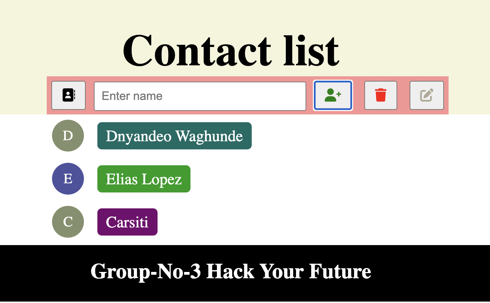

# Seperation of Concerns

## General info

build a small project from scratch using the separation-of-concerns-starter. A simple
 contact list website, in which the user will be able to add contact, remove con
 tact and edit contact from the list.

## Prototype



## Technologies

- HTML
- CSS
- VSC code
- Java Script

## Setup

- `npm run start`

## Code Examples

```
<!DOCTYPE html>
<html lang="en">

<head>
 <meta charset="UTF-8" />
 <link rel="icon" type="image/svg+xml" href="./client/public/favicon.svg" />
 <meta name="viewport" content="width=device-width, initial-scale=1.0" />
 <title>SOC Starter</title>

 <link href="./client/styles/index.css" rel="stylesheet" />
 <link rel="stylesheet" href="https://cdnjs.cloudflare.com/ajax/libs/font-awesome/6.1.1/css/all.min.css">
</head>

<body>
 <section class="container">
  <div class="title">
   <h1>Contact list</h1>
  </div>
  <div class="list-item">
   <form>
    <button id="refresh"><i class="fa-solid fa-address-book"></i></button>

    <input id="name-input" type="text" placeholder="Enter name">
    <button id="add-contact">
     <i class="icon1 fa-solid fa-user-plus"></i></i>
    </button>
    <button id="remove-contact">
     <i class="icon2 fa-solid fa-trash"></i>
    </button>
    <button id="edit-contact">
     <i class="icon3 fa-solid fa-pen-to-square"></i>
    </button>
   </form>
  </div>
 </section>
 <section class="add-list" id="contact-list">
 </section>
 <section>
  <footer class="footer">
   <h2>Group-No-3 Hack Your Future</h2>
  </footer>
 </section>
 <script type="module" src="./client/src/init.js"></script>
</body>
</html>
```

## Features

- A user can see the main title.
- A user can see all the contacts in their list.
- A user can add a new contact to their list.
- A user can remove any contact from their list.
- A user can edit the description of each contact in their list.
- A user can view initials of the name in the contact list.
- A user can view different contacts in different colors.
- A user can view contact list in alphabetical order: a-z.

## Status

Project is: _in progress_
[Project link](https://lab-brussels-1.github.io/Group-3-separation-of-concerns-starter/)

## Collaboration

- [Dnyandeo Waghunde](https://github.com/Dnyandeo33)
- [Elias Lopez](https://github.com/EliasMlopez99)
- [Carsiti](https://github.com/Carsiti)

## Coaches

- [Daniel](https://github.com/danielhalasz)
- [Unmesh](https://github.com/unmeshvrije)

node_modules
accessibility_report
