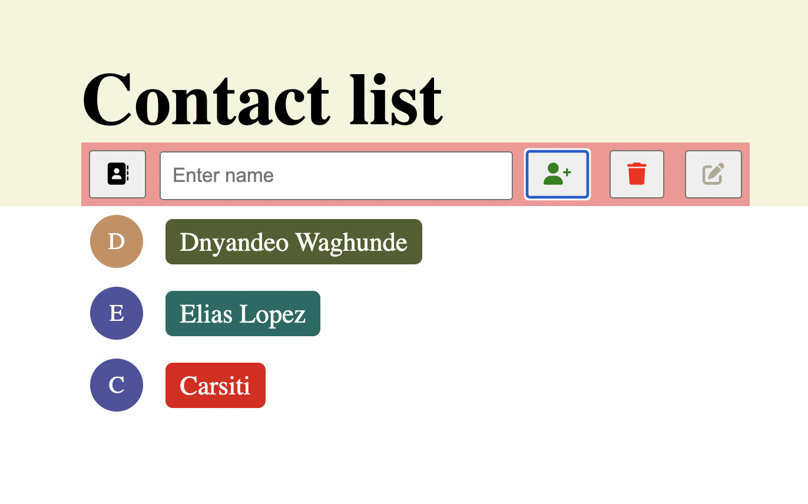

# Seperation of Concerns

## General info

build a small project from scratch using the separation-of-concerns-starter. A simple
 contact list website, in which the user will be able to add contact, remove con
 tact and edit contact from the list.

## Screenshots

## Technologies

- HTML
- CSS
- VSC code
- Java Script

## Setup

- `npm run start`

## Code Examples

## Features

- See all the items in the list
- Add a new item to the list
- Remove any item from the list
- Edit the description of each item in the list
- Mark an item as "done" or "not done"

## Status

Project is: _in progress_

## Collaboration

- [Dnyandeo Waghunde](https://github.com/Dnyandeo33)
- [Elias Lopez](https://github.com/EliasMlopez99)
- [Carsiti](https://github.com/Carsiti)

## Coaches

- [Daniel](https://github.com/danielhalasz)
- [Unmesh](https://github.com/unmeshvrije)

node_modules
accessibility_report
